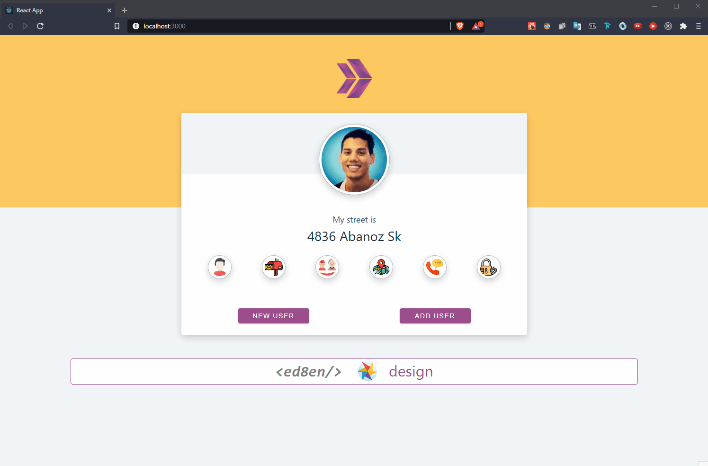

# Hi I'm Nurdoğan Bahadır 👋. Welcome to my Random User App Project with React.

This application was realized with the api provided to me by Clarusway. React was used while developing the application. UseState vs useEffect hooks were used. The purpose of the application is to see the information of random users coming to the ui and add them to our table if we want.

# Live Link of the Project

[Click Me](https://random-user-nurdoganbahadir.netlify.app)

# Libraries and Technologies I use

- useState
- useEffect
- react bootstrap
- bootstrap
- react icons
- axios
- API
  

# How to install

In the project directory, you can run:

### `npm install`

and

### `npm start`

# How does my project look

